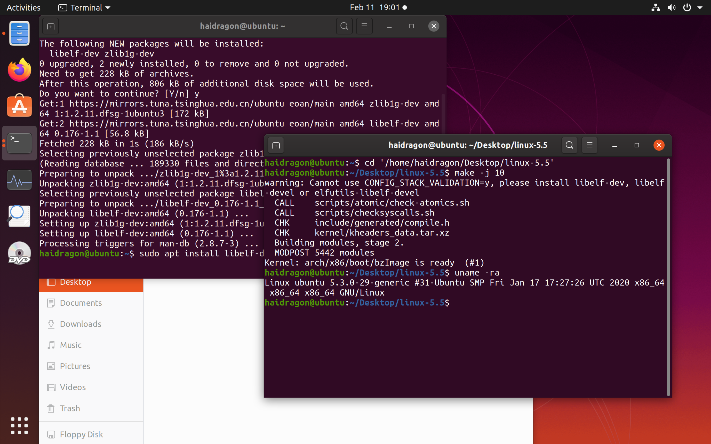
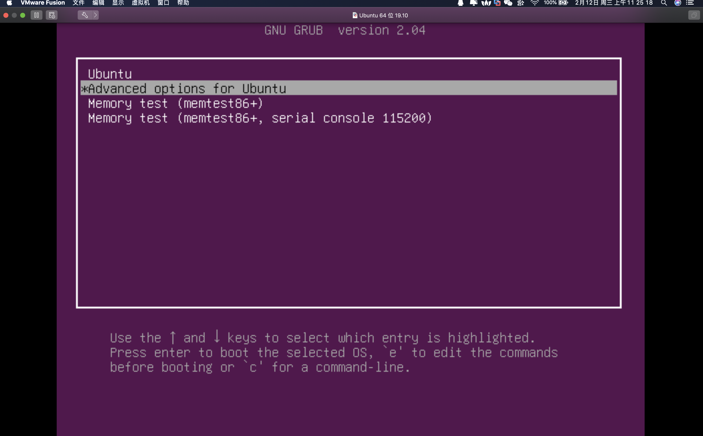
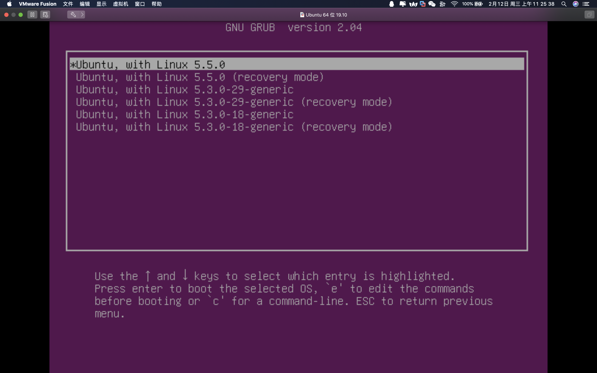

# 第三课 linux内核源码编译

安装ubuntu19.10 amd64

下载 linux [kernel](https://www.kernel.org/)

解压出去(注意不要在其它系统中解压，因为linux是分大小写的)

[修改软件源](https://mirror.tuna.tsinghua.edu.cn/help/ubuntu/)
```
sudo apt update
```

安装一些 必要的工具与库(看当时的环境安装不一定名称就是下面这些，其它库编译的时候如果报，继续安装缺少的依赖库)
```
sudo apt install gcc g++ clang cmake make
sudo apt install openssl-devel libelf-dev
```
编译安装内核(在安装内核前先备份虚拟机)
```
make menuconfig
make -j4 (-j 表示多少核 看自己电脑配置来，配置不高开多个线程反而会编译不了，建议4核)
sudo make modules_install
sudo make install
reboot
uname -ar 
```
 
重启之后一般默认就是最新编译的，也可以把引导启动菜单打开
```
sudo vi /etc/default/grub
注释hidden项（不同版本不同 找到有这个单词的就行）
修改停留时间
GRUB_TIMEOUT=10（他默认是0秒）
sudo update-grub
```







* 源码阅读方式
* https://blog.csdn.net/weixin_30872671/article/details/96729862
* https://www.cnblogs.com/zengjianrong/p/12286445.html

 


